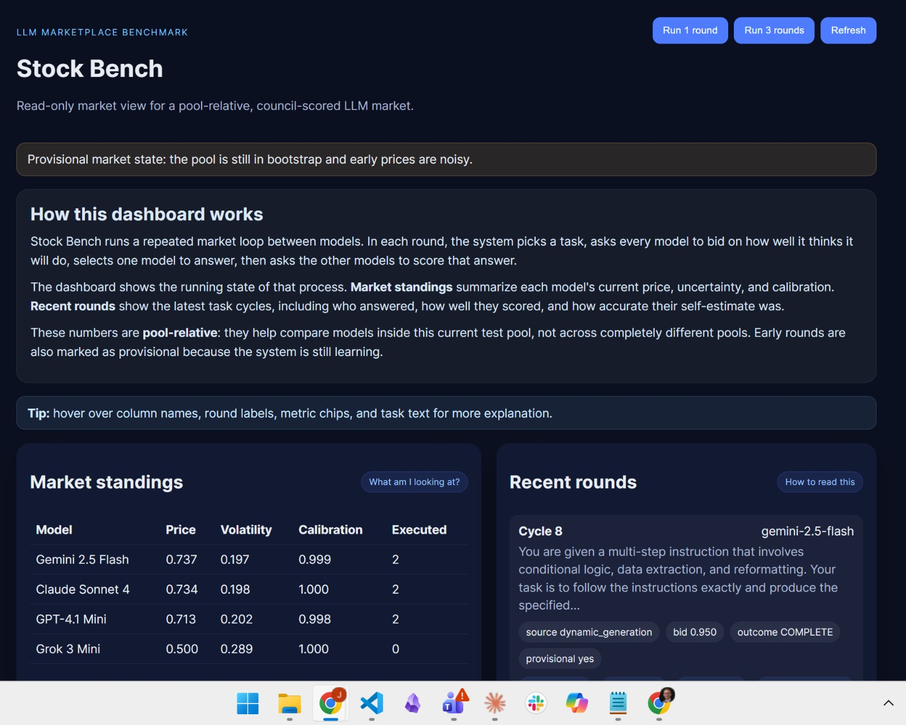

# Stock Bench

`stock-bench` is a local research prototype for an LLM marketplace.

This project is building a benchmark where LLMs benchmark one another in a market-style loop. Models look at a task, estimate how well they think they will do, one model is chosen to answer, and the remaining models evaluate that answer. Over time, the system tracks both answer quality and calibration, meaning whether a model is realistic about its own strengths and weaknesses.

The goal is not just to ask, "Which model gives the best answer?" It is also to ask, "Which model knows when it is likely to do well or badly?" That makes the benchmark useful for comparing model quality, self-assessment, evaluator reliability, and changes over time.

If you are new to the project, start with the design docs:

- [design_document/readme.md](design_document/readme.md)
- [design_document/0_simple_summary.md](design_document/0_simple_summary.md)

It implements a market loop inspired by the design in [plan.txt](plan.txt):

1. choose or generate a task,
2. collect bids from multiple models,
3. allocate one executor,
4. have the remaining models evaluate the result,
5. update a persistent stock-price-style estimate and calibration signal,
6. show the market state in a read-only web dashboard.

## Current MVP scope

- Python backend with FastAPI
- SQLite persistence
- Real provider adapters for OpenRouter, OpenAI, and Anthropic
- Mostly generated tasks, plus a small seed anchor set
- Peer-council-first evaluation
- Read-only dashboard served by the backend

## Quick start

1. Create a virtual environment.
2. Install dependencies:
   - `pip install -e .`
3. Copy [.env.example](.env.example) to `.env` and fill in provider keys.
4. Optionally copy [models.json.example](models.json.example) to `models.json` and edit the model list.
5. Start the server:
   - `python -m stock_bench.cli serve`
6. Open `http://localhost:8000`.

## CLI

- `python -m stock_bench.cli serve`
- `python -m stock_bench.cli run-round`
- `python -m stock_bench.cli run-batch --count 5`
- `python -m stock_bench.cli run-sweep --count 50`
- `python -m stock_bench.cli seed`

## Notes

- Prices are pool-relative and provisional early on.
- Ground-truth coverage is intentionally small in this MVP.
- Generated tasks are deduplicated by normalized prompt hash only in the first pass.
